# Mask R-CNN for Fruit Detection in an Orchard 
## Dataset
The dataset used in this project were collected from 3 sources namely:
- Aerobotics dataset - The images are sourced by flying the drone ∼ 2m above the tree canopy which generates 2.7k video imagery. These short videos are then segmented to generate images. 
- FUJI dataset [[link]](https://zenodo.org/record/3715991).
- ACFR dataset [[link]](http://data.acfr.usyd.edu.au/ag/treecrops/2016-multifruit/).

A total of 2853 images were collected from above three sources - 2081 images used for training the model and 772 for testing. All the images (both train and test set) were manually annotated using VGG annotator [[link]](http://www.robots.ox.ac.uk/~vgg/software/via/via.html). The entire dataset with the annotations can be downloaded [here](https://drive.google.com/drive/folders/1nVDuAx7qNio2drHVjADsG6s6wfZ4tKdH?usp=sharing). The contents of the link has the following structure:
```bash
Root: Mask-RCNN-for-Fruit_Detection
├── Python
├── dataset├── fruits├── train > (train images and JSON annotation file.)
│                    ├── val > (test images and JSON annotation file.)
│         			 ├── annotations-csv (Annoations in CSV format)
├── mask_rcnn_pretrained_weights > mask_rcnn_coco.h5
│           
└── trained_model > mask_rcnn_fruit_0477.h5
```

## Sample images in the dataset
Here are some samples of the images used in this project
[images] 
<table style="width:100%">
  <tr>
    <th>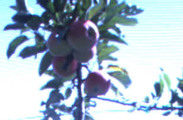</th>
    <th>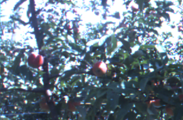</th>
  </tr>
  <tr>
    <th></th>
    <th></th>
  </tr>
</table>

## Directory Structure
Repository: Mask-R-CNN-for-Fruit-Detection
```bash
Root:
├── Python
├── assets├── datasets├── fruits├── train > (4 sample images and annotation file.)
│         │                     ├── val > (3 sample images and annotation file.)
│         ├── history > training-stats
│         ├── logs > trained-models
├── evaluation
├── mrcnn├── __init__.py
│        ├── config.py   
│        ├── model.py
│        ├── parallel_model.py
│        ├── utils.py
│        ├── visualize.py
├── setup.py
├── README.md
├── requirements.txt
├── via.html
└── .gitignore
```

## Detailed description of repository content
- [Python](Python) - This folder contains [fruits.ipynb](Python/fruits.ipynb) notebook. Mask R-CNN model is trained and tested in this notebook.
- [assets](assets) - This folder contains 3 sub-directories datasets, history, and logs:
	- [datasets/fruits/train](assets/datasets/fruits/train) - this folder consist of training images and corresponding JSON annotations file.
	- [datasets/fruits/val](assets/datasets/fruits/val) - contains testing images and the JSON file with the annotations.
	- [history](assets/history) - this directory holds (will hold) the training statistics - accuracy and losses. This statistics can also be logged in Tensorbord [[link]](https://www.tensorflow.org/tensorboard) during model training.
	- [logs](assets/logs) - trained model is saved here. For any particular model training instance a subdirectory will be created and model saved at each epoch. The created directory will be named in this format: {class_name}{date}T{time}, for example, the reposity contains  [fruit20200802T0017](assets/logs/fruit20200802T0017) for the model training that was initiated on Aug,2 2020 at 0017. 
- [evaluation](evaluation) - Trained model is evaluated using files in this directory. The folder contains the following dirs, subdirs and files:
	- [metrics.pdf](evaluation/metrics.pdf) - This PDF files discusses the following: The original source of data (3 sources), the metrics used to evaluate the model and the perfomance of Mask R-CNN on fruit detection task based on those metrics.
	- [results](evaluation/results) - contains all the results for the metric used to evaluate the model - Confusion Matrix, Precision , Recall, Average precision and Precision x Recall curve.
	- [generate_truth_masks.py](evaluation/generate_truth-masks.py) - This script is used to generate the annotations/labels for each image. This is important for the purposes of per-image evaluation.
	(Ideally, this should be the first script to be executed in the process of evaluation). Executing this script creates `truth_masks` folder which contain per-image ground-truth masks for both train and test set. 
	- [Evaluation.py](evaluation/Evaluation.py) contains a class that defines all the metrics used in the project: Confusion matrix, AP, Precision and Recall.
	- [MaskReconstruction.py](evaluation/MaskReconstruction.py) - This script contains all functions related to manipulation of model output from contour reconstruction to drawing and writing contors.
	- [runMain.py](evaluation/runMain.py) - Running this script calls MaskRCNN_Evaluation class in Evaluation.py. The script is mainly used to generate and save the results (important).
- [mrcnn](mrcnn) - this folder contains all the core files needed to train Mask R-CNN. The model itself is defined in [model.py](mrcnn/model.py). Other files in the folder includes [config.py](mrcnn/config.py) (contains Configuration class for Mask R-CNN), [parallel_model.py](mrcnn/parallel_model.py) (to set up parallel processing), [utils.py](mrcnn/utils.py) (contains common utility functions and classes), [visualize.py](mrcnn/visualize.py) (facilitate visualization of model output).
- example-output - Used for output visualization. The content of folder is used to display the results in this README.md file and nothing else - Not used in training or evaluating the model.
- [requirements.txt](requirements.txt) - contains all the libraries and packages required run the model. Specific versions of libraries are defined to ease reproducibility.
- [setup.py](setup.py) - This file is executed as a part of setup process. The process installs the necessary dependencies that are missing. Once you have gone through `Setup` section executing this file won't be necessary.
- [via.html](via.html) - This is fully-fledged VGG annotator. The online version of the annotator can be accessed
[here.](http://www.robots.ox.ac.uk/~vgg/software/via/via.html)

## Setup
- Clone this repository
- [Optional] Set up Python virtual environment - You may find [this article](https://medium.com/analytics-vidhya/creating-python-virtual-environment-and-how-to-add-it-to-jupyter-notebook-4cdb41717582) helpful.
- Upgrade pip and setup tools
```bash
pip install -U setuptools
python3 -m pip install --upgrade pip
```
- Install the dependencies from [requirements.txt](requirements.txt)
```bash
pip3 install -r requirements.txt
```
- Download the datasets and Mask R-CNN pre-trained weights [[link]](https://drive.google.com/drive/folders/1nVDuAx7qNio2drHVjADsG6s6wfZ4tKdH?usp=sharing) into corresponding folders. The pretrained weights can be donwloaded [here](https://github.com/matterport/Mask_RCNN/releases) as well. The weights should be saved in [assets](assets) folder
- [Optional] The trained model (trained_model/mask_rcnn_fruit_0477.h5) used to generate the results is part of the content of the above link. If you are interested in reproducing the results without training the model place this file should be placed in the [logs](assets/logs) folder. 


## Training progress plot

## Sample Mask RCNN results

## Evaluation
<table width="100%">
	<tr>
		<th>RGB Image</th>
		<th>Truth Masks</th>
		<th>Mask R-CNN Output (Confidence, bounding box and segmentation mask)</th>
		<th>Segmentation Mask</th>
	</tr>
	<tr>
		<th>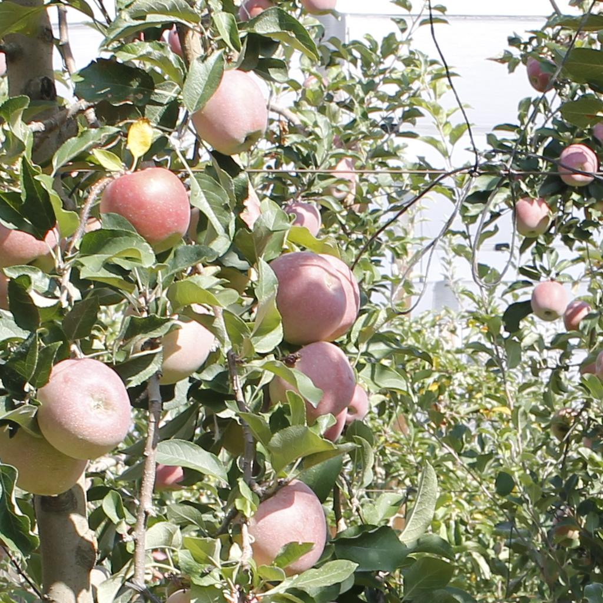</th>
		<th>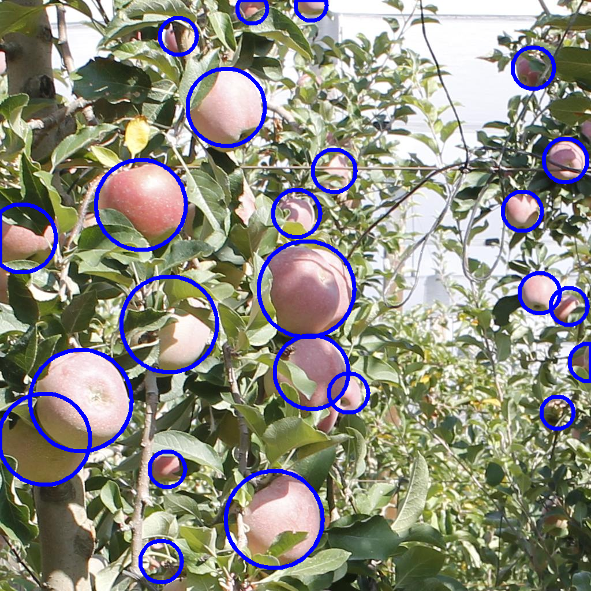</th>
		<th>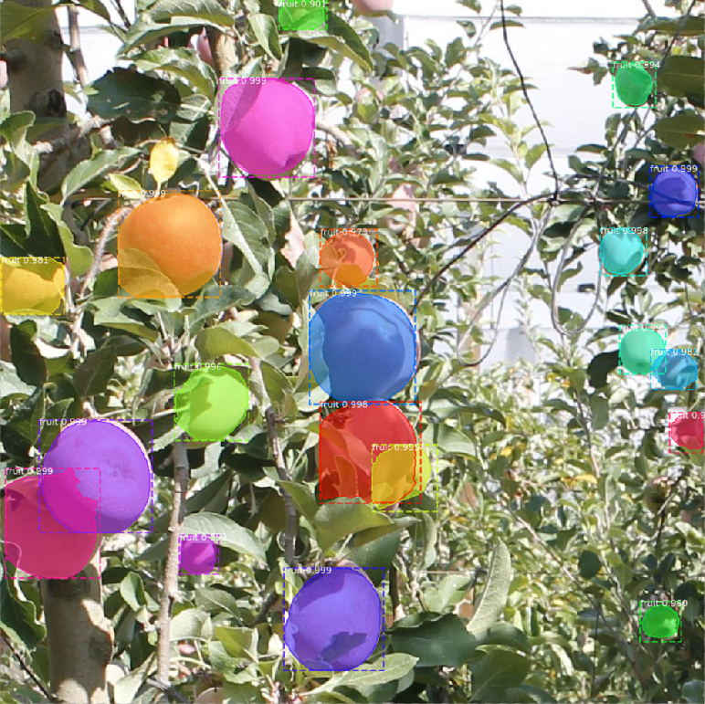</th>
		<th>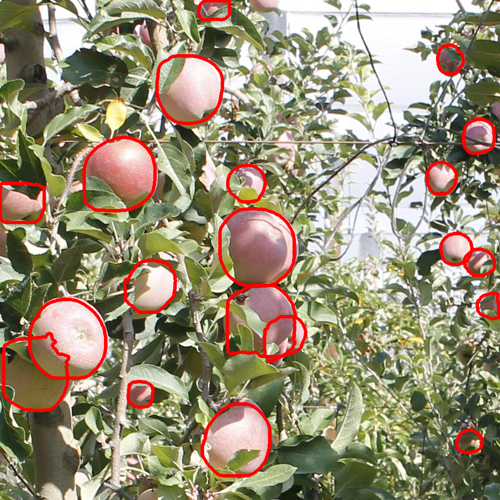</th>
	</tr>
	<tr>
		<th>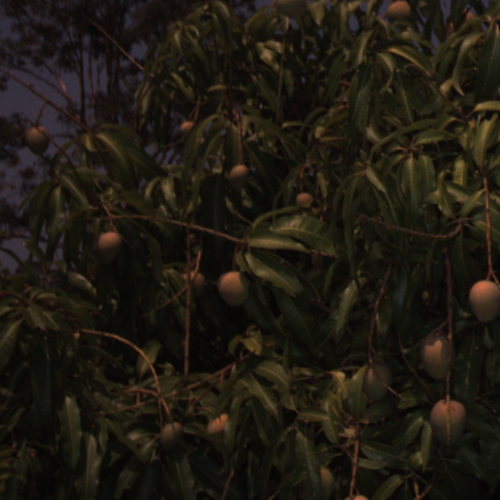</th>
		<th></th>
		<th>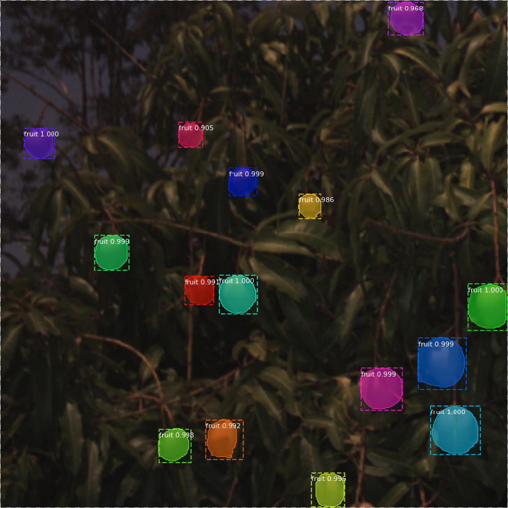</th>
		<th>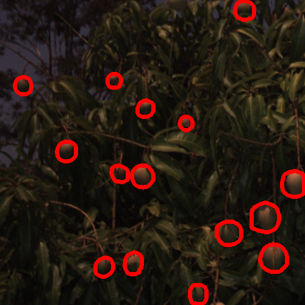</th>
	</tr>
	<tr>
		<th>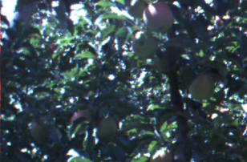</th>
		<th></th>
		<th>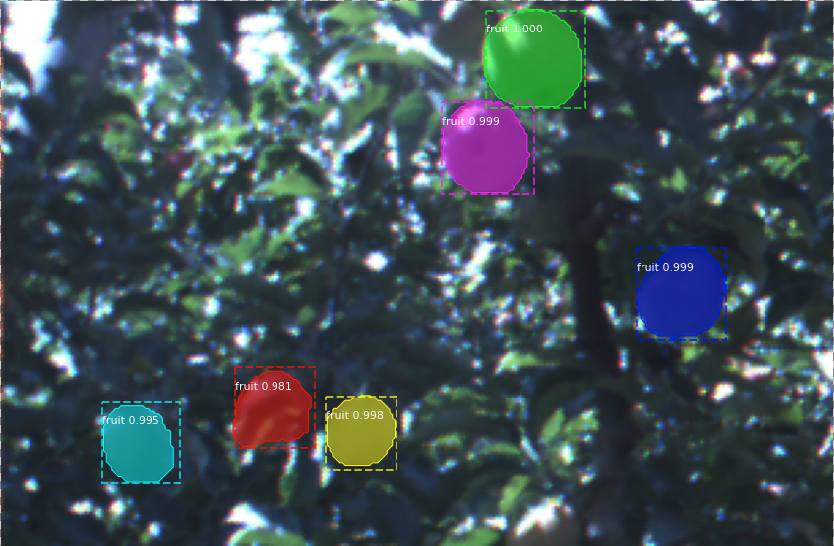</th>
		<th>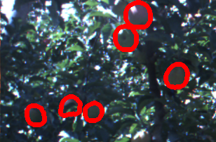</th>
	</tr>
</table>
 - Sample of Mask RCNN with segmentation masks extracted
 - Brief description of the metrics: precision, recall, F1, AP, and PR curve
 - Tabulate the perfomance of the model and plot the curves where applicable.
 - Link to the paper work containing the details about the results. Include the paper on the repo.