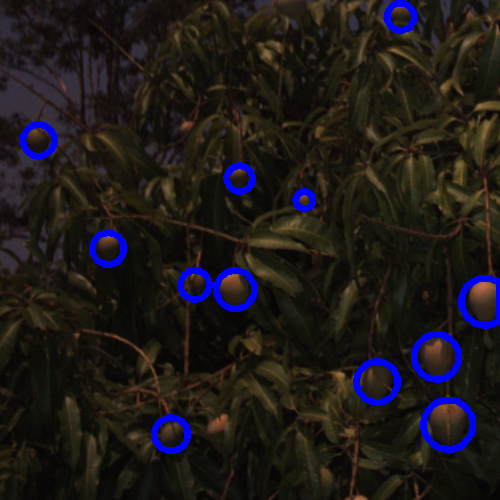
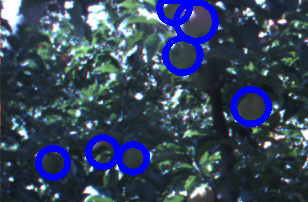

    
	
# Mask R-CNN for Fruit Detection in an Orchard 
## Dataset
The dataset used in this project is a merge betweeen the following 3 datasets:
- Aerobotics dataset - The images are sourced by flying the drone ∼ 2m above the tree canopy which generates 2.7k video imagery. These short videos are then segmented to generate images. 
- FUJI dataset - This dataset is composed of images of apple trees
captured using Microsoft Kinect v2.
- ACFR dataset - This dataset was collected by a team in The University of Sydney, Australia. The orchard images were gathered using Shrimp. It contain images of apples, almonds and mangoes.

A total of 3372 images were collected from the above three sources - 2024 images used for training the model, 674 for validation and 674 for testing (a 60-20-20 split). All the images (both train, validation and test set) were manually annotated using VGG annotator [[link]](http://www.robots.ox.ac.uk/~vgg/software/via/via.html). The entire dataset with the annotations can be downloaded [here](https://drive.google.com/drive/folders/1nVDuAx7qNio2drHVjADsG6s6wfZ4tKdH?usp=sharing). The contents of the link have the following structure:
```bash
Root: Mask-RCNN-for-Fruit_Detection
│
├── dataset├── fruits2├── train > (train images and JSON annotation file.)
│                     ├── val > (validation images and JSON annotation file.)
│                     ├── test > (test images and JSON annotation file)
│
├── annotations (contains annotation files in JSON and CSV for all the 3 sets)
│
├── mask_rcnn_pretrained_weights > mask_rcnn_coco.h5
│
└── sets (contains image names for each set)
```

## Sample images in the dataset
Here are some samples of the images used in this project
[images]
<table style="width:100%">
  <tr>
    <th></th>
    <th></th>
  </tr>
  <tr>
    <th></th>
    <th></th>
  </tr>
</table>

## Repository Structure
Repository: Mask-R-CNN-for-Fruit-Detection
```bash
Root:
├── Python
├── assets├── datasets├── fruits2├── train > (put train images here)
│         │                      ├── val > (put val images in this folder)
│         │                      ├── test > (put test images here)
│         ├── history > training-stats (tensorboard output)
│         ├── assets ├──logs > trained-model
│
├── evaluation ├── results > model performance
│              ├── truth_masks ├── test_masks_truth > truth masks for test set.
│              │               ├── train_masks_truth > truth masks for train set.
│              ├── Evaluation.py
│              ├── MaskReconstruction.py
│              ├── generate_truth-masks.py
│              ├── metrics.pdf
│              ├── runMain-Loop.py
│              ├── runMain-One.py
│
├── mrcnn├── __init__.py
│        ├── config.py   
│        ├── model.py
│        ├── parallel_model.py
│        ├── utils.py
│        ├── visualize.py
│
├── samples ├── balloon
│           ├── coco
│           ├── fruits2
│           ├── nucleus
│           ├── shapes
│           ├── demo.ipynb
│
├── example-output > images and plots used only within this README.md file
├── setup.py
├── README.md
├── requirements.txt
├── via.html
├── licence files
└── .gitignore 
```

## Detailed description of repository content
- [Codes for training](fruits_train_TF2.ipynb) Mask R-CNN on orchard images and the codes for [running detection](fruits_detect_TF2.ipynb) using trained model.
- [assets](assets) - This folder logs directory. Logs directory (will) contain models logs are saved here during model training. The folder also contrains history folder.
	- [logs](assets/logs) - trained model is saved here. For any particular model training instance, a subdirectory will be created and the model saved at each epoch. The created directory will be named in this format: {class_name}{date}T{time}, for example, the repository contains  [fruit20200802T0017](assets/logs/fruit20200802T0017) for the model training that was initiated on Aug,2 2020 at 0017H. 
	- [history](assets/history) - this directory holds (or will hold) the training statistics - accuracy and losses. These statistics can also be obtained from Tensorbord [[link]](https://www.tensorflow.org/tensorboard) during and/or after model training.

- [evaluation](evaluation) - Trained model is evaluated using files in this directory. The folder contains the following directories, subdirectories, and files:
	- [metrics.pdf](evaluation/metrics.pdf) - This PDF file discusses the following: The sourcing of data, the metrics used to evaluate the model, and the performance of Mask R-CNN on fruit detection task based on those metrics.
	- [results](evaluation/results) - contains the model perfomance stats based on object detection metrics - Confusion Matrix, Precision, Recall, Average precision, and Precision x Recall curve.
	- [generate_truth_masks.py](evaluation/generate_truth-masks.py) - This script is used to generate the annotations/labels for each image. This is important for per-image evaluation.
	(Ideally, this should be the first script to be executed during evaluation). Executing this script creates `truth_masks` folder which contains per-image ground-truth masks for both train, validation and test set. 
	- [Evaluation.py](evaluation/Evaluation.py) contains a class that defines all the metrics used in the project: Confusion matrix, AP, Precision, and Recall.
	- [MaskReconstruction.py](evaluation/MaskReconstruction.py) - This script contains all functions related to manipulation of model output from contour reconstruction to drawing and writing contours.
	- [runMain-One.py](evaluation/runMain-One.py) - Running this script calls MaskRCNN_Evaluation class in Evaluation.py. Use this script to run detection in one sample image and generate model performance results.
	- [runMain-Loop.py](evaluation/runMain-Loop.py) - Running this script calls MaskRCNN_Evaluation class in Evaluation.py. The script is mainly used to run detections, generate and save the results for all the images in train, val and test sets(important).

- [mrcnn](mrcnn) - this folder contains all the core files needed to train Mask R-CNN. The model itself is defined in [model.py](mrcnn/model.py). Other files in the folder includes [config.py](mrcnn/config.py) (contains Configuration class for Mask R-CNN - defines configuration parameters like input size, epochs, convolution backbone e.t.c.), [parallel_model.py](mrcnn/parallel_model.py) (to set up parallel processing), [utils.py](mrcnn/utils.py) (contains common utility functions and classes), [visualize.py](mrcnn/visualize.py) (facilitate visualization of model output).
- [example-output](example-output) - Used for output visualization. The content of the folder is used to display the results in this README.md file and nothing else. For this reason, the contents of the folder are not consequential in reproducing the results.
- [requirements.txt](requirements.txt) - contains all the libraries and packages required to run the model. Specific versions of libraries are defined to ease reproducibility.
- [setup.py](setup.py) - This file is executed as a part of the setup process. The process installs the necessary dependencies that are missing. Once you have gone through `Setup` section below executing this file won't be necessary.
- [via.html](via.html) - This is fully-fledged VGG annotator. The online version of the annotator can be accessed
[here.](http://www.robots.ox.ac.uk/~vgg/software/via/via.html)

## Setup
- Clone this repository
- [Optional] Set up Python virtual environment - You may find [this article](https://medium.com/analytics-vidhya/creating-python-virtual-environment-and-how-to-add-it-to-jupyter-notebook-4cdb41717582) helpful.
- Upgrade pip and setup tools
```bash
pip install -U setuptools
python3 -m pip install --upgrade pip
```
- Install the dependencies from [requirements.txt](requirements.txt)
```bash
pip3 install -r requirements.txt
```
```bash
requirements.txt has the following package versions:

numpy==1.19.2
tensorflow==2.5.0   
scipy==1.4.1 
Pillow==8.2.0  
Cython==0.29.23   
matplotlib==3.2.2  
scikit-image==0.16.2
opencv-python==4.1.2.30 
h5py==3.1.0  
imgaug==0.2.9
```

- Download the datasets [[link]](https://drive.google.com/drive/folders/1nVDuAx7qNio2drHVjADsG6s6wfZ4tKdH?usp=sharing) into corresponding folders.
- [Optional] The trained model `mask_rcnn_fruit_0477.h5` used to generate the results can be downloaded from the [assets section of the release](https://github.com/kipronokoech/Mask-R-CNN-for-Fruit-Detection/releases/download/v2.5.0/mask_rcnn_fruit_0477.h5). If you are interested in reproducing the results without training the model place this file in the [logs](assets/logs/fruits220210518T1629) folder.
- Evaluation:
	- Generate per-image truth masks by executing [generate_truth-masks.py](evaluation/generate_truth-masks.py).
	- Execute [runMain-Loop.py](evaluation/runMain-Loop.py) in order to generate evaluation results. All the evaluation results will be written into [results](evaluation/results) folder.


## Training progress plot
The following plots shows training losses for 150 epochs:
<table width="100%">
	<tr>
		<th></th>
		<th></th>
		<th></th>
	</tr>
</table>

## Sample Mask RCNN results
- Column 1: RGB Image from the test set.
- Column 2: Truth Masks.
- Column 3: Mask R-CNN Output (Confidence, bounding box, and segmentation mask).
- Column 4: Segmentation Mask.

<table width="100%">
	<tr>
		<th></th>
		<th></th>
		<th></th>
		<th></th>
	</tr>
	<tr>
		<th></th>
		<th></th>
		<th></th>
		<th></th>
	</tr>
	<tr>
		<th></th>
		<th></th>
		<th></th>
		<th></th>
	</tr>
</table>

## Evaluation
A detailed description of the performance metrics used in this project can be found in [metrics.pdf](evaluation/metrics.pdf). Here are some articles you may find helpful as well [[link1]](https://towardsdatascience.com/on-object-detection-metrics-with-worked-example-216f173ed31e), [[link2]](https://towardsdatascience.com/confusion-matrix-and-object-detection-f0cbcb634157).
### Confusion Matrix
| IoU Threshold  |  Set | True Positive(%)  | False Positive(%)| False Negative(%)|
|---|---|---|---|---|
| 0.2  |  Train | 91.48  | 8.51 |7.82|
|      |  Test  |  88.25 | 11.75|15.40|
|---|---|---|---|---|
| 0.3  | Train  |  91.35 |8.65 |7.96 |
|    | Test |87.86 |12.14 | 15.79  |
|---|---|---|---|---|
| 0.4  | Train  |  91.16 |8.84 |8.14 |
|    | Test |87.17 |12.83 | 16.48  |
|---|---|---|---|---|
| 0.5  | Train  |  90.61 |9.39 |8.70 |
|    | Test |85.65 |14.35 | 18.01 |
|---|---|---|---|---|

### Average Precision at different thresholds
| Set  |  AP@20 | AP@30 | AP@40| AP@50|
|---|---|---|---|---|
| Train  |  0.9625 | 0.9514| 0.9457 |0.9344|
| Test   |  0.8997  | 0.8854 | 0.8732|0.8470|

### Precision x Recall curves

<table width="100%">
	<tr>
		<th></th>
		<th></th>
	</tr>
</table>

### References

1. He, K., Gkioxari, G., Dollar, P., and Girshick, R. Mask R-CNN. 2017 IEEE International Conference on Computer Vision (ICCV), Oct 2017. doi: 10.1109/iccv.2017.322. [1](https://arxiv.org/abs/1703.06870) [2](http://dx.doi.org/10.1109/ICCV.2017.322)

2. Padilla, R., Netto, S. L., and da Silva, E. A. A survey on performance metrics for object-detection algorithms. In 2020 International Conference on Systems, Signals and Image Processing (IWSSIP), pages 237–242. IEEE, 2020.

3. Datasets:
	- [Entire dataset (Merge of FUJI, ACFR and Aerobotics datasets)](https://drive.google.com/drive/folders/1nVDuAx7qNio2drHVjADsG6s6wfZ4tKdH?usp=sharing).
	- [FUJI dataset](https://zenodo.org/record/3715991).
	- [ACFR dataset](http://data.acfr.usyd.edu.au/ag/treecrops/2016-multifruit/).
